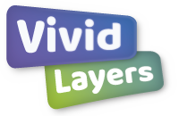
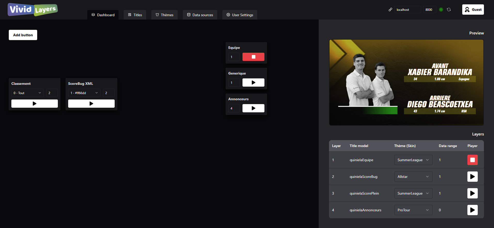
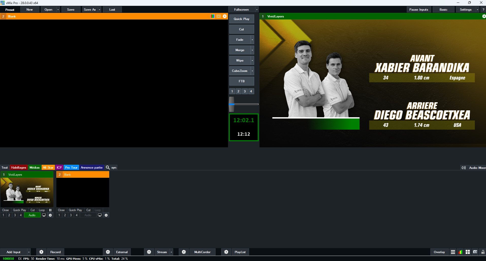

# Install

1. Download last VividLayersServer [release](https://github.com/Muxtel/VividLayers-Public/releases)
2. Copy all the files in `/demo` to your local `~/Documents/VividLayers/`
3. Execute (if it wasn't after installation) VividLayersServer.exe
4. A browser opens with a web client
5. Import a Dashboard config from `~/Documents/VividLayers/dashboards/`   
6. Enjoy it in preview mode...
7. Or continue :
8. Click on the "Copy URL to clipboard" button (top right)
9. Open your streaming app (OBS, vMix...)
10. Create a Browser input and paste the URL
11. Enjoy

# Description
VividLayers est un ensemble d'applications pour l'habillage et le titrage 2D et pseudo-3D pour la télévision et le streaming vidéo, **multi plateforme** (Windows/OsX/Android) et **multi support** (Desktop/App Smartphone/App Tablette)

VividLayers est compatible avec les logiciel de streaming / réalisation habituels :

 - ✔️ vMix
 - ✔️ OBS
 - ✔️ Tricaster

# Composition du package :
## VividLayers Server : 
Un **moteur** de titrage (backend fastAPI) pouvant fonctionner :
   - soit dans une machine locale en apppliaction desktop, 
   - soit en tant que service distant, installé sur un serveur.
Le serveur dessert un module d'affichage du titreur avec un display_token par utilisateur :
   - en local : `localhost:8000/display/[display_token]`
   - ou distant: `vividlayers.com/display/[display_token]`  (prévu pour 2027)
Il dessert également un service de gestion de titrage :
   - en local sur navigateur, desservie par le serveur sur `http://localhost:8000/app`
   - ou depuis un serveur distant `vividlayers.com/` (prévu pour 2027)

## VividLayers Client
Distribuée en tant qu'app desktop, ce logiciel permet de se connecter à une instance de **VividLayers Server** distante. Par exemple on peut piloter le contenu d'un serveur de titrage déporté sur une autre machine. 

# Avantages

Des outils comme GTTitle de vMix ne permettent pas de faire du templating itératif, c'est à dire, avec des données pouvant comporter plusieurs lignes. Il est quasiment impossible d'adapter l'affichage d'un titre en fonction des données et du nombre d'items que comporte la base de données ("data source", dans vMix) 

Par exemple, dans un sport où un match se joue en 3 manches, dans vMix, on ne peut pas adapter le design d'un **score bug** pour n'afficher que le nombre de manches en cours, à moins de passer par de la programmation .NET complexe.

Aussi, contrairement à d'autres services de titrage online :
- VividLayers peut être installé localement (il a surtout été fait pour ça), afin de pouvoir réaliser un programme TV sans être tributaire d'une connexion internet, ce qui rend le système plus **fiable**.
- On peut très facilement créer des titrages intégralement **personnalisés**, pas seuelement graphiquement, mais également structurelement et comportementalement.
- VividLayers peut extraire des données à partir d'un fichier **XLS** ou **XML**, ce qui facilite grandement la tâche de l'opérateur qui va saisir les informations à afficher : 
   - **XLS** : aucun apprentissage n'est nécessaire pour remplir un tableau **XCELL** 
   - **XML** : la synchronisation avec des outils comme **ScoreBoard Ocr** ou des **flux de données** xml est entièrement automatisée.

# Features

- Création de titres **totalement personnalisés** (structure, apparence et comportement), qui peut être 
   - **pour plus de liberté**, codable directement en **HTML/CSS** et **JS** personnalisé si besoin
   - **pour plus de facilité**, dessinable via un interface de design 
- Déclinaison de chaque titre en plusieurs **thèmes / skins**, ce qui permet de créer un seul titre qui sera valable pour plusieurs chartes graphiques différentes. Par exemple, des saisons sportives diférentes, saison d'émission TV différente...
- **Nombre d'overlays infinis** et réordonnables
- **Autant d'affichages que de comptes utilisateur**
- Moniteur "preview"
- Client multi-plateforme (Windows/OsX/Android) et un client multi support (Desktop/App Smartphone/App Tablette)

